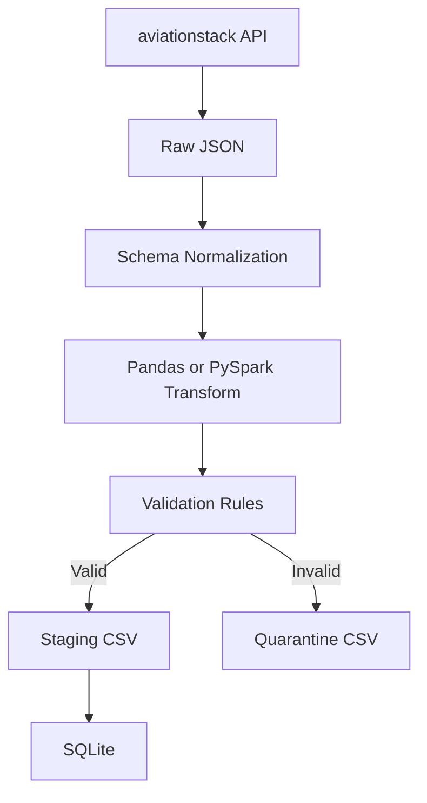

# Dual-Engine Flight Pipeline

[](LICENSE)
[](https://www.python.org/)
[](#)
[](https://github.com/jamesoost/dual-engine-flight-pipeline/actions/workflows/ci.yml)

A compact ETL project that runs the same flight-data workflow with two engines:
- pandas
- PySpark

Both engines follow the same schema contract and validation rules, so behavior remains consistent when both run on the same raw payload.

## Purpose and Features of This Repo

- Develop hands-on pandas and PySpark experience through equivalent ETL implementations
- Uses shared validation rules to enforce parity
- Applies a quarantine pattern for invalid records
- Persists valid records to CSV and SQLite

## Architecture



## Outcomes

- Built one ETL flow that runs with both pandas and PySpark while keeping a shared validation contract.
- Verified positive and negative transformation cases with deterministic sample records in tests.
- Confirmed parity between engines on valid/invalid counts and validation error labels.
- Added stage-level CLI execution (`extract`, `transform`, `load`) for demo-friendly step-by-step runs.
- Added CI automation for linting and transformation tests on every push and pull request.

## Quickstart

1. Create and activate a virtual environment:

```bash
python -m venv venv
source venv/bin/activate
```

2. Install dependencies in one step (pandas + spark + dev tools):

```bash
python -m pip install -e ".[dev,spark]"
```

Optional lighter install (pandas only):

```bash
python -m pip install -e ".[dev]"
```

3. Create `.env` in project root:

```env
AVIATIONSTACK_ACCESS_KEY=your_key_here
```

4. For Spark runs, set Java home:

```bash
export JAVA_HOME=/usr/lib/jvm/java-21-openjdk-amd64
```

## Run

Pandas:

```bash
python main.py --engine pandas
```

Spark:

```bash
python main.py --engine spark
```

If `JAVA_HOME` is not exported in your shell, use a one-off command:

```bash
JAVA_HOME=/usr/lib/jvm/java-21-openjdk-amd64 python main.py --engine spark
```

If `--engine` is omitted, the pipeline uses `ETL_ENGINE` from environment (default: `pandas`).

## Run Steps Independently

Use `--step` to run one stage at a time.

1. Extract only (same for pandas and pyspark paths):

```bash
python main.py --step extract
```

2. Transform only with pandas (uses latest file in `data/raw` by default):

```bash
python main.py --step transform --engine pandas
```

3. Transform only with pyspark:

```bash
python main.py --step transform --engine spark
```

4. Transform from a specific raw file:

```bash
python main.py --step transform --engine pandas --input-raw data/raw/flights_YYYYMMDD_HHMMSS.json
```

5. Load only (uses latest valid CSV in `data/staging` by default):

```bash
python main.py --step load
```

6. Load from a specific valid CSV:

```bash
python main.py --step load --input-valid-csv data/staging/flights_processed_YYYYMMDD_HHMMSS.csv
```

## Output Locations

- Raw API payloads: `data/raw`
- Valid CSV output: `data/staging`
- Invalid quarantined rows: `data/quarantine`
- SQLite database: `data/processed/aviation.db`
- Log files: `data/logs`

Full pipeline run returns:
- `engine`
- `valid_rows`
- `invalid_rows`
- `valid_output`
- `invalid_output`
- `sqlite_stats` (`inserted_rows`, `skipped_rows`, `total_rows`)

## Validation Rules

Rows are quarantined when any of these fail:
- required fields missing (`airline`, `flight_number`, `flight_date`)
- datetime parsing fails
- arrival timestamp is before departure timestamp

## Tests

```bash
python -m pytest -q
```

Current coverage includes:
- pandas invalid-row handling
- pandas vs spark parity on shared input

## Project Layout

- `main.py`: CLI entrypoint
- `config.py`: environment-driven config
- `src/extract.py`: API extract and raw save
- `src/pipeline.py`: orchestration and engine dispatch
- `src/schema.py`: canonical columns and payload normalization
- `src/validation.py`: shared validation rules (pandas + spark)
- `src/pandas_pipeline/`: pandas transform and load
- `src/pyspark_pipeline/`: spark transform
- `tests/`: validation and parity tests
